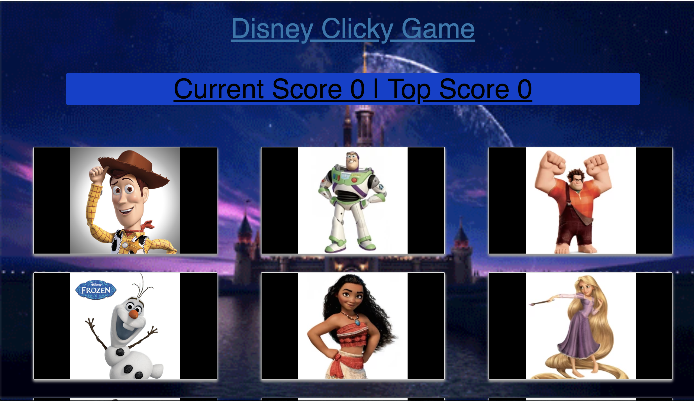

# Disney Clicky Game

This is a classic clicky game with a disney characters theme. The objective is to click all the character to win. If you click on the same character twice then you loose. Seems simple right, though with one twist in which the character randomly shuffle after each click. So remember which characters you clicked and try to reach the high score. 

[Tech News Scraper]()

[Portfolio](https://mawais54013.github.io/New-Portfolio/)

# Images

This is the main page for the game, with 12 disney characters ranging from various movies. 


This is example gif of how the program works.
# Technology Used
- Javascript
- React.js
- Node.js
- CSS
- Yarn
- NPM

# Code Snippets 
1)The following code allows the images to be randomized once they are clicked and also characterizes each character if they were clicked. If a user clicks a character then the score increases by 1 and then the characters are randomized with the last code set with sorted function included. 

```
if(characters[i].click === 0){
    this.setState({message: ""});
    characters[i].click = characters[i].click + 1;
    this.setState({score : this.state.score + 1}, function(){
    console.log(this.state.score);
    });

    this.state.characters.sort(() => Math.random() - 0.5)
    return true; 
} 
```

2) The following code uses map to give each character card items to include. So each character will have a image, id, name, and randomize function that executes when they are clicked. 

```
{this.state.characters.map(character => (
    <CharacterCard
    id={character.id}
    key={character.id}
    name={character.name}
    image={character.image}
    randomize={this.randomize}
    />
))}
```

# Author 
[Muhammad Awais](https://mawais54013.github.io/New-Portfolio/)

[Github](https://github.com/mawais54013)